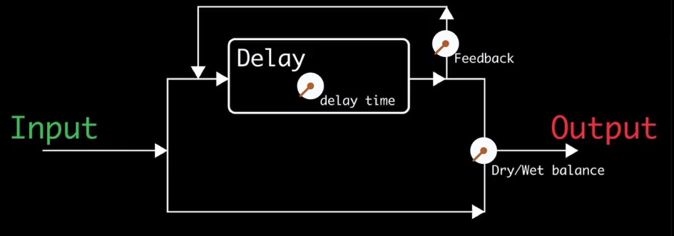

# Week5

Delay is similar to the Filter. The short filter is delay, and long delay becomes filter.

* modulated delay effect: short time delay. it is used to create chorus, phases, a sense of width (like stereo sound) in the mix.
* slap back: long time delay. It is kind of echo, and it is used to create a sense of space.
* reverb: hundreds and hundreds of very very short delay.  It is used to create the sounds like noise.

A 2 millisecond delay sounds like: Comb filtering  
A short delay with very high feedback sounds like: A held pitch  
When a short delay with very high feedback produces a tone, increasing the delay time: Lowers the frequency of the pitch  

## Delay Concept

* wet: delayed sound
* dry: un-delayed sound

Delay sound is constructed from wet and dry sound. Wet sound is the delayed sound of original sound.

There are below parameters.

* delay time: the length of delay
* feedback: if you use feedback, you can get series of repeat. And its length is related to the fade away time.
* wet/dry balance: the balance between wet and dry

## The Delay Spectrum

The delay is comb filter.  That is the result of reflection of sound in the floor.  
Because of the reflection, it cancels some frequency band.  
The delay becomes longer, the band that is cancelled is lower (the frequency of sound becomes lower).
And short delay and fast feedback raises the frequency (if you lower the delay, the sound becomes lower also).

## Modulated Short Delay
The very short delay to create the comb filter, but then we slowly change the delay time.  
It causes the nice kind of wash of sound that moves back and forth.

Flanger is a just short delay that's been put in the motion by a low frequency oscillator.
(low frequency oscillator give a cyclic motion to the parameter, it is kind of automatic motion).
It's very often It's done differently in the left and right speaker to give it a back and forth kind of swirly wide stereo presence. 

Phaser is much like flanger.  
The difference is flanger had a strict comb filter, It was even notches across the stereo spectrum. The phaser is not even across the spectrum, it is also deep notches across the filter, but you can control more.
It can be very vowel like in that the sounds it make can sound like changing the vowel sounds of a mouth.  
It's a great effect to the guitar and for thick pad, things that are kinds of overwhelming in the mix.  
Because the phaser can notch out a specific portion of the frequency range in a really interesting way.  
That could possibly leave room for the other instruments in the mix and it can also be a way to make something sound wider by making it sound different in the left and right channel.

Chorus is multiple detuned copy. It is like a doppler effect that is caused when the car is passing.  
Changing the delay time can actually have a great impact on the pitch of the sounds. It is used in the chorus effect.   
The role of the chorus effect is to make it seems like there's multiple performers performing that same part. It cause the thick a little bit out of tune sound.   
It's very useful to make sound wide (quite stereo), and out to the sides.  
This is used in the context of an entire mix to move out some instrument to the side of the mix. 

## Filters Overview

* pass filter: allow the specific frequency sound through, but it attenuate or lower the another frequency.
 * low pass filter: allow low frequency, but the high. (ex. over 100Hz is attenuated to 12dB per octave)
 * high pass filter: allow high frequency, but the low. it is usually used to cut the noise.
 * band pass filter: allow the range of frequency, but the other
* shelving filter: like band pass filter, but not cutoff , but reduce or boost.
 * low shelving filter: it works like high pass filter.
 * high shelving filter: it works like low pass filter.
* bell shape (parametric EQ): it reduces or boosts around specific frequency (the shape is like bell). It is used to explorer the frequency range.
 
(The low pass filter (cut high frequency) is not used as much in the mixing context).  
Instead, we tend to use shelving filter on the low and high end.

The bell shape boosting is useful to learn the connection between number of hertz and the audible sound.
And bell shape reducing works like moving notch filter.

parameters

* cut-off frequency: the center location of bell curve, or the point at which it's already cutting 3 decibels
* slope of the curve(band width): it's measured by decibels per octave. it means 1 octave below the cut-off point, x decibels is cut.
* Q (on a bell filter): The width of the boost or cut

## Mixing EQ

* high pass filter: it is useful to cut the noise or rumble.
* high shelving filter: it is useful to emphasize(boost) the sound. it is quite useful to guide the listener.
* low shelving filter:  it is useful to emphasize the base like sound.
* mid-range EQ: it is difficult to use. boosting the mid-range is very obvious and can sound unnatural, but cut is nice. it is used to decrease some loud instrument (drum or percussion).

Ex.

* base: to emphasize low frequency by low shelving filter, and cut high frequency by high shelving filter.
* guitar: to emphasize base part of melody, use high shelving filter to reduce high frequency part of melody.
* keyboard: to emphasize high part of melody, use high pass filter and low shelving filter.

The guitar and the keyboard is also melody. now, emphasize the base part of melody by guitar, and high part is keyboard.

## Medium Delay: Slap Back

The slap back delay is flutter echo (just like clap your hands in the two parallel hard surfaces).  
The reverb is the effect of sound of a space. Many people use it, but it is sometimes kinds of noise (little overwhelming).  
The slap back delay is more useful than reverb often.

parameters

There are delay and output dry wet parameter in the both left and right.  
And the cross feedback adjusts the left to right / right to left pass.  
20% wet, 80 ms delay time, 0% feedback is suitable for slap-back effect.

## Long Delay
Long delay is like the echo in the mountain.  
It is difficult to use it in the mix. But it is useful to emphasize the underlying musical context.  

There are point to use long delay.

* make difference between the dry and wet(delayed) signal: so many plugin has feature to change the delay slightly.
* tend to get in the way of your harmony: sounds like hanging on long time.

If you use it in the complex piece of music, it will clash the harmonies.
The long delay is useful to make the listener to understand what they're hearing.

## Reverb
It's the sense of space (feel like in large room).  

* gather instruments: sounds like all the instruments that you are hearing is in a single location -> use one reverb to entire sound
* exotic type: to use reverb to create beautiful sonic environment -> use reverb severally (isolate in the mix)
* guide the listener's focus: it is common to use the reverb to the vocal to isolate it.

The reverb is constructed from dry/wet. 100% wet is only reverb sound.  
The dry/wet control likes kinds of front/back control. It becomes important element to guide the listener to that one thing you want to them focus on.

Categories of Reverb

* algorithmic reverb: make reverb by some kind of formula
* convolution reverb: it is like a sampler. The sound will be like actually recorded in real space (but you're limited in the type of manipulation like in sampler).

algorithmic reverb parameters

* early reflections: a set of short delays. it sounds like a bunch of those slap-back 
 * predelay: delay for entire start of reverb 
 * room size: it works like slap back 
 * room shape 
* diffuse reverb: 
 * reverb time: it is going to control the size of space. (usually below 2 seconds (orchestra hall is about 2-3 seconds).)
 * high cut: it changes material in the space. it works like soft curtains in the room or hard walls which tend to the high ends.

All the parameters of reverb are related to the artificial space that we're trying to manipulate.  
In the convolution reverb plugin, you can choose many situations that represents real spaces (ex.jazz hall, cannon).
The best reverbs are where you don't notice it's there but when you take it away it's obvious.
 
## Width in Mixing

The hierarchy of the sound.

* High Hat
* Vocals <- the stereo width is useful
* Snare Drum
* Bass
* Kick Drum

Because if you add guitar, keyboard, some kinds of instruments that play the melody can kind of get in the way of the vocal.  
You can use width to set the vocal in the middle. For example, left is guitar, right is keyboard, and the center is vocal.  

The important point is the balance of left and right. If you put the something off to left, you have to put something off to right also.  

## Space in Mixing
It is important to image the space, where is vocal, instruments, listeners.
(Researching about Haas Effect is good to study about the reverb).

All you can control is the relative things. How one element in your mix is related to another. 
-> if you make some sound quiet, another sound will be loud. 

To express the distance...

* volume: the sound from far away is quiet but close is loud.
* reverb: If the sound source is close, it is dry sound. And if it is far awasy, the sound will be wet.
* high end: Things far away will be duller, and things closer is will be brighter. So high shelving filter will be a really important distance cue for us. 
* stereo width: In the piano, high quote is right and low quote is left. It makes the sense of width. If you are far away, the width of high/low will be narrow like you are going away from piano.

